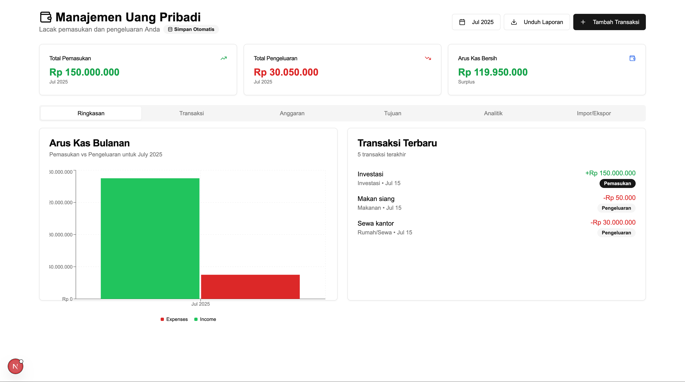
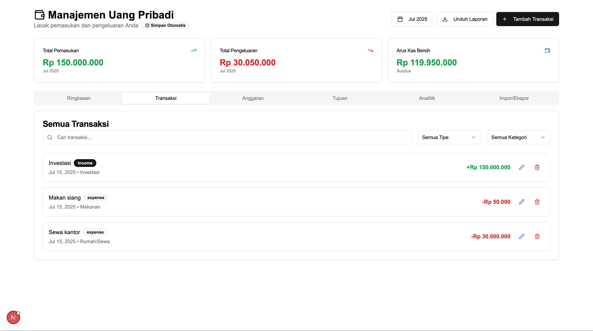
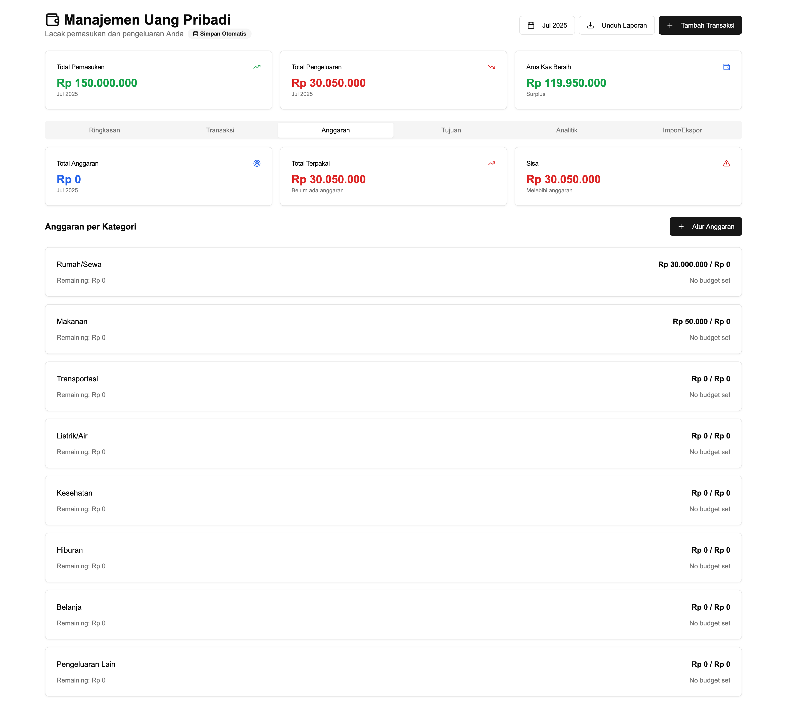
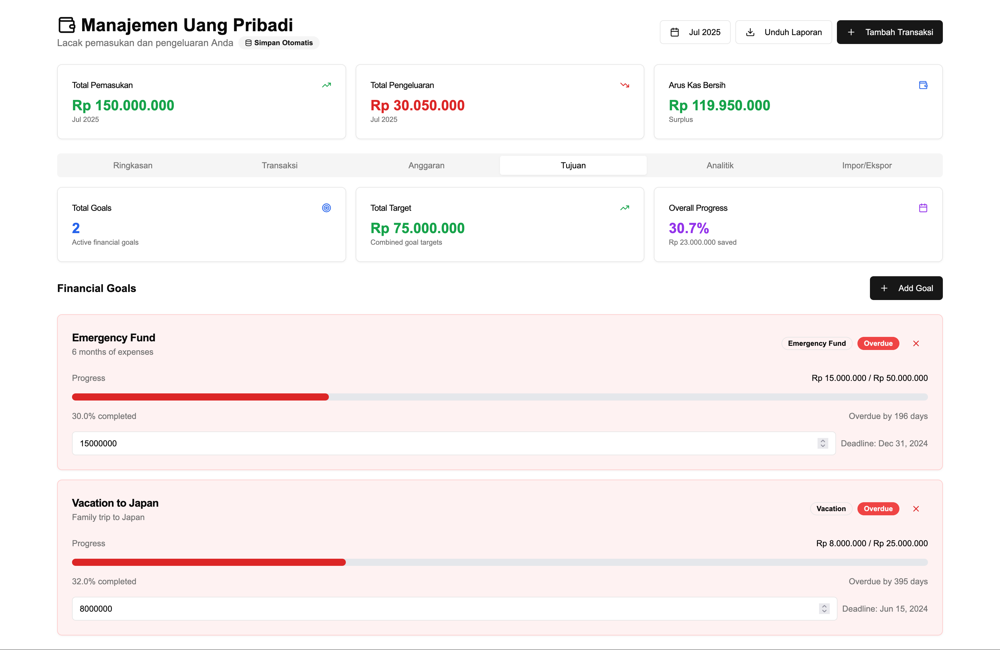
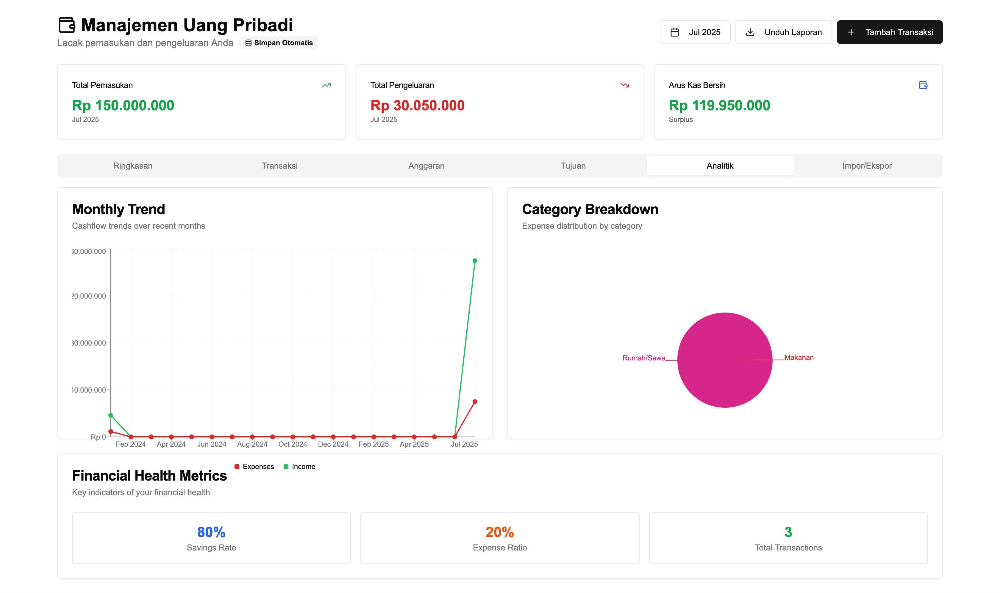
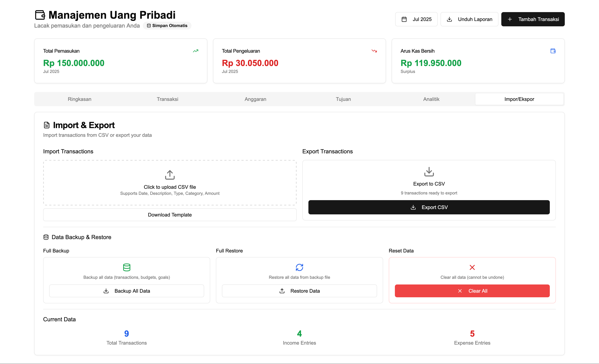

# 💰 Manajemen Uang Pribadi

Aplikasi manajemen keuangan pribadi yang komprehensif dibangun dengan **Next.js 15**, **TypeScript**, dan **Tailwind CSS**. Kelola pendapatan, pengeluaran, anggaran, dan tujuan keuangan Anda dalam satu tempat dengan model **satu perangkat, satu pengguna**.


## 🔐 Model Pengguna

Aplikasi ini menggunakan **model satu perangkat, satu pengguna** untuk kesederhanaan dan keamanan:

- ✅ **Satu Pengguna Aktif**: Hanya satu pengguna yang dapat aktif per perangkat
- ✅ **Data Terisolasi**: Setiap pengguna memiliki data yang terpisah dan aman
- ✅ **Logout Sederhana**: Tombol logout untuk mengakhiri sesi dan membersihkan data
- ✅ **Reset Data**: Opsi untuk menghapus semua data dan memulai dari awal
- ✅ **Tidak Ada Switching**: Menghilangkan kompleksitas perpindahan antar pengguna

## 📸 Screenshot Aplikasi

<!-- Tambahkan screenshot aplikasi Anda di sini -->


_Dashboard utama aplikasi Manajemen Uang Pribadi_

### Fitur Utama dalam Gambar

| Dashboard                               | Transaksi                                  | Anggaran                            |
| --------------------------------------- | ------------------------------------------ | ----------------------------------- |
|  |  |  |

| Tujuan Keuangan                  | Analitik                               | Import/Export                                   |
| -------------------------------- | -------------------------------------- | ----------------------------------------------- |
|  |  |  |

## 🚀 Fitur

### � Manajemen Pengguna (One Device, One User)

- ✅ **Pengguna Tunggal** - Satu pengguna aktif per perangkat untuk kesederhanaan
- ✅ **Onboarding Sederhana** - Proses pembuatan pengguna yang mudah
- ✅ **Data Terisolasi** - Setiap pengguna memiliki storage data yang terpisah
- ✅ **Logout & Reset** - Opsi untuk mengakhiri sesi atau reset seluruh data
- ✅ **Auto-Save** - Data tersimpan otomatis di localStorage browser

### �📊 Manajemen Transaksi

- ✅ **Tambah, Edit, Hapus Transaksi** - Operasi CRUD lengkap untuk transaksi keuangan
- ✅ **Transaksi Berulang** - Atur pendapatan/pengeluaran berulang mingguan, bulanan, atau tahunan
- ✅ **Kategori Transaksi** - Organisir transaksi dengan kategori yang telah ditentukan
- ✅ **Tag Transaksi** - Tambahkan tag khusus untuk organisasi dan filtering yang lebih baik
- ✅ **Filter Lanjutan** - Filter berdasarkan jenis, kategori, rentang tanggal, dan istilah pencarian

### 💳 Manajemen Anggaran

- ✅ **Pengaturan Anggaran Bulanan** - Tetapkan batas pengeluaran untuk setiap kategori pengeluaran
- ✅ **Pelacakan Anggaran Real-time** - Pantau pengeluaran terhadap batas anggaran
- ✅ **Peringatan Anggaran Visual** - Peringatan berkode warna saat mendekati atau melebihi anggaran
- ✅ **Analitik Anggaran** - Ikhtisar komprehensif kinerja anggaran

### 🎯 Tujuan Keuangan

- ✅ **Pembuatan & Pelacakan Tujuan** - Tetapkan dan pantau objektif keuangan
- ✅ **Berbagai Kategori Tujuan** - Dana Darurat, Liburan, Rumah, Mobil, Pendidikan, dll.
- ✅ **Visualisasi Progres** - Bar progres visual dan persentase penyelesaian
- ✅ **Manajemen Deadline** - Lacak tenggat waktu tujuan dengan peringatan terlambat

### 📈 Analitik Lanjutan

- ✅ **Berbagai Jenis Grafik** - Grafik batang, grafik garis, dan grafik pie
- ✅ **Metrik Kesehatan Keuangan** - Tingkat tabungan, rasio pengeluaran, analitik transaksi
- ✅ **Rincian Kategori** - Analisis distribusi pendapatan/pengeluaran yang detail
- ✅ **Analisis Tren** - Tren dan pola arus kas bulanan

### 📁 Manajemen Data

- ✅ **Import/Export CSV** - Impor transaksi dari file CSV dengan validasi
- ✅ **Backup Data** - Ekspor semua data untuk backup dan analisis
- ✅ **Template Import** - Unduh template CSV untuk kemudahan import data
- ✅ **Penanganan Error** - Validasi komprehensif selama proses import

## 🛠️ Stack Teknologi

- **Framework Frontend**: Next.js 15.2.4
- **Bahasa**: TypeScript
- **Styling**: Tailwind CSS
- **Komponen UI**: Radix UI primitives + shadcn/ui
- **Grafik**: Recharts
- **Penanganan Tanggal**: date-fns
- **Ikon**: Lucide React
- **Storage**: Browser localStorage (SSR-safe)
- **State Management**: React hooks dengan custom localStorage hooks
- **Development**: ESLint, Prettier

## 📁 Struktur Proyek

```
cashflow-management/
├── app/
│   ├── components/
│   │   ├── transaction-form.tsx      # Form pembuatan/edit transaksi
│   │   ├── transaction-list.tsx      # Daftar transaksi dengan filter
│   │   ├── cashflow-chart.tsx        # Visualisasi grafik
│   │   ├── budget-management.tsx     # Pengaturan dan pelacakan anggaran
│   │   ├── financial-goals.tsx       # Manajemen tujuan keuangan
│   │   ├── import-export.tsx         # Fungsi import/export data
│   │   └── user-management.tsx       # Manajemen pengguna (one device, one user)
│   ├── hooks/
│   │   ├── use-local-storage-ssr.ts  # Hook localStorage yang SSR-safe
│   │   └── use-user-storage.ts       # Hook manajemen pengguna
│   ├── types/
│   │   └── transaction.ts            # Definisi tipe TypeScript
│   ├── utils/
│   │   └── currency.ts               # Utilitas format mata uang
│   ├── globals.css                   # Gaya global
│   ├── layout.tsx                    # Layout aplikasi
│   └── page.tsx                      # Komponen halaman utama
├── components/
│   ├── ui/                          # Komponen UI shadcn/ui
│   └── theme-provider.tsx           # Konfigurasi tema
├── hooks/                           # Additional custom React hooks
├── lib/                            # Library utilitas
└── public/                         # Aset statis
```

## 🚀 Memulai

### Prasyarat

- Node.js 18+
- npm, yarn, atau pnpm package manager

### Instalasi

1. **Clone repository**

   ```bash
   git clone https://github.com/jutionck/cashflow-management.git
   cd cashflow-management
   ```

2. **Install dependencies**

   ```bash
   npm install
   # atau
   yarn install
   # atau
   pnpm install
   ```

3. **Jalankan development server**

   ```bash
   npm run dev
   # atau
   yarn dev
   # atau
   pnpm dev
   ```

4. **Buka browser**
   Navigasi ke [http://localhost:3000](http://localhost:3000)

### Script yang Tersedia

- `npm run dev` - Jalankan development server
- `npm run build` - Build aplikasi production
- `npm run start` - Jalankan production server
- `npm run lint` - Jalankan ESLint untuk kualitas kode
- `npx tsc --noEmit` - Type checking tanpa output files

### Environment Variables

Aplikasi ini tidak memerlukan environment variables khusus karena menggunakan localStorage browser. Namun untuk production, pertimbangkan:

```env
# Optional: Analytics atau monitoring
NEXT_PUBLIC_ANALYTICS_ID=your-analytics-id

# Optional: Error reporting
NEXT_PUBLIC_SENTRY_DSN=your-sentry-dsn
```

### Deployment

**Vercel (Recommended):**

```bash
# Install Vercel CLI
npm i -g vercel

# Deploy
vercel --prod
```

**Netlify:**

```bash
# Build command: npm run build
# Publish directory: .next
```

**Docker:**

```dockerfile
FROM node:18-alpine
WORKDIR /app
COPY package*.json ./
RUN npm ci --only=production
COPY . .
RUN npm run build
EXPOSE 3000
CMD ["npm", "start"]
```

## 📱 Panduan Penggunaan

### 0. Memulai dengan Pengguna Baru

**Pertama Kali Menggunakan Aplikasi:**

1. Buka aplikasi di browser
2. Anda akan melihat layar selamat datang
3. Masukkan nama Anda di field "Nama Pengguna"
4. Klik "Buat Pengguna" untuk memulai
5. Dashboard akan langsung terbuka dengan data kosong

**Mengelola Sesi Pengguna:**

- **Logout**: Klik tombol "Keluar" di kanan atas untuk mengakhiri sesi
- **Hapus & Reset**: Di menu pengguna, pilih "Hapus & Reset Data" untuk menghapus semua data dan memulai fresh
- **One Device, One User**: Hanya satu pengguna yang dapat aktif pada satu waktu

### 1. Mengelola Transaksi

**Menambah Transaksi:**

1. Klik tombol "Add Transaction"
2. Isi detail transaksi:
   - Tanggal, Deskripsi, Jumlah
   - Jenis (Pendapatan/Pengeluaran)
   - Kategori
   - Tag (opsional)
   - Pengaturan berulang (opsional)
3. Klik "Add Transaction" untuk menyimpan

**Mengedit Transaksi:**

1. Pergi ke tab Transaksi
2. Klik ikon edit (✏️) pada transaksi manapun
3. Modifikasi detail dalam form
4. Klik "Update Transaction" untuk menyimpan perubahan

### 2. Mengatur Anggaran

**Membuat Anggaran Bulanan:**

1. Navigasi ke tab Budget
2. Klik "Set Budget"
3. Pilih kategori dan tetapkan batas bulanan
4. Sistem akan otomatis melacak pengeluaran Anda terhadap anggaran ini

**Memantau Kinerja Anggaran:**

- Hijau: Di bawah anggaran (pengeluaran baik)
- Kuning: Peringatan (80-100% anggaran terpakai)
- Merah: Melebihi anggaran (melebihi batas)

### 3. Tujuan Keuangan

**Membuat Tujuan:**

1. Pergi ke tab Goals
2. Klik "Add Goal"
3. Atur detail tujuan:
   - Judul dan deskripsi
   - Jumlah target
   - Jumlah saat ini (jika ada)
   - Deadline
   - Kategori
4. Lacak progres dan perbarui jumlah saat Anda menabung

### 4. Analitik & Laporan

**Lihat Wawasan Keuangan:**

- **Tab Overview**: Ringkasan cepat dengan metrik kunci
- **Tab Analytics**: Grafik dan rincian detail
- **Metrik Kesehatan Keuangan**: Tingkat tabungan, rasio pengeluaran

**Ekspor Data:**

1. Pergi ke tab Import/Export
2. Klik "Export CSV" untuk mengunduh data transaksi Anda
3. Gunakan untuk backup atau analisis eksternal

### 5. Mengimpor Data

**Proses Import CSV:**

1. Unduh template CSV terlebih dahulu
2. Isi data transaksi Anda
3. Upload file CSV
4. Tinjau preview import
5. Konfirmasi untuk mengimpor semua transaksi yang valid

## �️ Arsitektur Teknis

### SSR-Safe Storage System

Aplikasi ini menggunakan sistem storage yang aman untuk Server-Side Rendering (SSR):

```typescript
// useLocalStorageSSR Hook
// Mencegah hydration mismatch antara server dan client
const [data, setData, isLoaded] = useLocalStorageSSR<Type>('key', defaultValue);
```

**Fitur Kunci:**

- ✅ **Hydration Safety**: Tidak ada mismatch antara server dan client rendering
- ✅ **Loading States**: State `isLoaded` untuk menangani loading UI
- ✅ **Type Safety**: Full TypeScript support dengan generics
- ✅ **Stable Dependencies**: useRef pattern untuk mencegah infinite loops

### User Storage Architecture

```typescript
// useUserStorage Hook
// Manajemen pengguna dengan isolasi data
const {
  currentUser, // User yang sedang aktif
  createUser, // Membuat pengguna baru
  deleteUser, // Hapus pengguna dan data (reset)
  logoutUser, // Logout tanpa hapus data
  getUserStorageKey, // Generate storage key per user
} = useUserStorage();
```

### Component Architecture

- **Page Component**: Main dashboard dengan state management
- **User Management**: Handle user lifecycle dan UI
- **Transaction Components**: CRUD operations untuk transaksi
- **Chart Components**: Visualisasi data dengan Recharts
- **Form Components**: Forms dengan validation

## 🔧 Kustomisasi

### Menambah Kategori Baru

Perbarui array kategori di komponen yang sesuai:

```typescript
// Di transaction-form.tsx dan budget-management.tsx
const expenseCategories = [
  'Rumah/Sewa',
  'Makanan',
  'Transportasi',
  'Listrik/Air',
  'Kesehatan',
  'Hiburan',
  'Belanja',
  'Pengeluaran Lain',
  'Kategori Baru Anda', // Tambahkan di sini
];
```

### Memodifikasi Format Mata Uang

Perbarui format mata uang di `app/utils/currency.ts`:

```typescript
export const formatIDR = (amount: number): string => {
  return new Intl.NumberFormat('id-ID', {
    style: 'currency',
    currency: 'IDR',
    minimumFractionDigits: 0,
  }).format(amount);
};
```

### Konfigurasi Tailwind

Proyek ini menggunakan konfigurasi Tailwind khusus. Modifikasi `tailwind.config.ts` untuk menyesuaikan:

- Warna
- Spacing
- Tipografi
- Breakpoint

## � Troubleshooting

### Masalah Umum

**1. Data Hilang Setelah Refresh**

```bash
# Periksa apakah localStorage browser tersedia
# Pastikan tidak dalam mode private browsing
# Cek console browser untuk error
```

**2. Hydration Errors**

```bash
# Jalankan type checking
npx tsc --noEmit

# Restart development server
npm run dev
```

**3. Build Errors**

```bash
# Clear cache dan reinstall
rm -rf .next node_modules package-lock.json
npm install
npm run build
```

**4. Performance Issues**

- Batasi jumlah transaksi yang ditampilkan sekaligus
- Gunakan pagination untuk dataset besar
- Pertimbangkan export/import untuk data lama

### Browser Compatibility

- ✅ Chrome 90+
- ✅ Firefox 90+
- ✅ Safari 14+
- ✅ Edge 90+
- ❌ Internet Explorer (tidak didukung)

## �📞 Dukungan

Jika Anda memiliki pertanyaan atau memerlukan bantuan:

1. Periksa halaman [Issues](https://github.com/jutionck/cashflow-management/issues)
2. Buat issue baru dengan deskripsi detail
3. Bergabung dalam diskusi di repository

## 🙏 Penghargaan

- [Next.js](https://nextjs.org/) - React framework
- [Tailwind CSS](https://tailwindcss.com/) - CSS framework
- [Radix UI](https://www.radix-ui.com/) - UI primitives
- [shadcn/ui](https://ui.shadcn.com/) - UI component library
- [Recharts](https://recharts.org/) - Chart library
- [Lucide](https://lucide.dev/) - Icon library
- [date-fns](https://date-fns.org/) - Date utility library

## 📝 Changelog

### v2.0.0 - One Device, One User Model

- ✅ Implemented one device, one user architecture
- ✅ Added SSR-safe localStorage hooks
- ✅ Simplified user management interface
- ✅ Added logout and data reset functionality
- ✅ Fixed hydration issues and infinite re-render loops
- ✅ Improved user experience with non-blocking loading states

### v1.0.0 - Initial Release

- ✅ Basic transaction management
- ✅ Budget tracking
- ✅ Financial goals
- ✅ Analytics dashboard
- ✅ Import/export functionality

## 📄 License

This project is licensed under the MIT License - see the [LICENSE](LICENSE) file for details.

## 📷 Cara Menambahkan Screenshot

Untuk menambahkan screenshot ke README ini:

1. **Buat folder screenshots** di root project:

   ```bash
   mkdir screenshots
   ```

2. **Ambil screenshot** dari aplikasi yang sedang berjalan:

   - Jalankan aplikasi dengan `pnpm dev`
   - Buka http://localhost:3000 di browser
   - Ambil screenshot untuk setiap fitur:
     - `dashboard.png` - Halaman utama dengan ringkasan
     - `transactions.png` - Tab transaksi dengan daftar
     - `budget.png` - Tab anggaran dengan progress
     - `goals.png` - Tab tujuan keuangan
     - `analytics.png` - Tab analitik dengan grafik
     - `import-export.png` - Tab import/export

3. **Simpan screenshot** dengan resolusi optimal (1200x800px atau lebih)

4. **Pastikan file screenshot** tersimpan di folder `screenshots/`

5. **Commit dan push** perubahan ke repository

---

**Dibangun dengan ❤️ untuk manajemen keuangan yang lebih baik**
