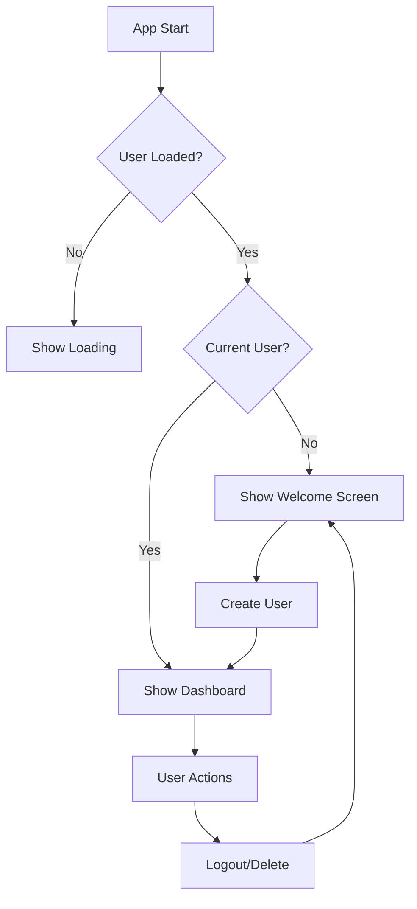
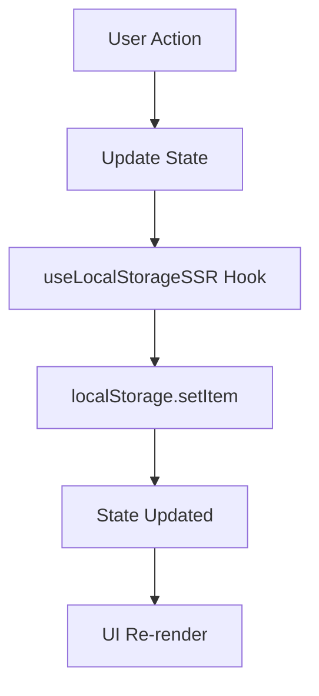

# 🛠️ Technical Documentation

## Architecture Overview

This application uses a **One Device, One User** model with SSR-safe localStorage persistence. The architecture is designed for simplicity, performance, and reliability.

## Core Hooks

### useLocalStorageSSR

**Purpose**: SSR-safe localStorage hook that prevents hydration mismatches.

```typescript
export function useLocalStorageSSR<T>(
  key: string,
  initialValue: T
): [T, (value: T | ((prev: T) => T)) => void, boolean];
```

**Key Features:**

- ✅ Prevents hydration mismatch errors
- ✅ Returns loading state for UI handling
- ✅ Uses useRef for stable dependencies
- ✅ Type-safe with TypeScript generics

**Implementation Details:**

```typescript
const initialValueRef = useRef(initialValue);
const [isLoaded, setIsLoaded] = useState(false);
const [storedValue, setStoredValue] = useState<T>(initialValue);

useEffect(() => {
  if (typeof window !== 'undefined') {
    try {
      const item = window.localStorage.getItem(key);
      if (item) {
        setStoredValue(JSON.parse(item));
      }
    } catch (error) {
      console.error(`Error loading localStorage key "${key}":`, error);
    } finally {
      setIsLoaded(true);
    }
  }
}, [key]);
```

### useUserStorage

**Purpose**: User management with data isolation and session handling.

```typescript
export function useUserStorage() {
  return {
    currentUser: User | null,
    createUser: (name: string) => User,
    deleteUser: (userId: string) => void,
    logoutUser: () => void,
    getUserStorageKey: (baseKey: string) => string,
    isCurrentUserLoaded: boolean,
  };
}
```

**Key Features:**

- ✅ One device, one user enforcement
- ✅ Data isolation per user with storage keys
- ✅ Clear data separation and cleanup
- ✅ Session management (logout vs delete)

## Component Architecture

### Main Page Component

**File**: `app/page.tsx`

**Responsibilities:**

- Main dashboard orchestration
- User authentication check
- Transaction state management
- Data filtering and aggregation
- Export functionality

**Key State:**

```typescript
const [transactions, setTransactions] = useLocalStorageSSR<Transaction[]>(
  transactionStorageKey,
  []
);
const [selectedDate, setSelectedDate] = useState<Date>(new Date());
const [showTransactionForm, setShowTransactionForm] = useState(false);
```

### User Management Component

**File**: `app/components/user-management.tsx`

**Responsibilities:**

- User creation interface
- Logout functionality
- Data reset options
- Welcome screen for new users

**One Device, One User Implementation:**

- No user switching interface
- Single user creation form
- Clear logout and reset options
- Simplified user management

### Transaction Components

**Files**:

- `app/components/transaction-form.tsx`
- `app/components/transaction-list.tsx`

**Responsibilities:**

- CRUD operations for transactions
- Form validation and submission
- List display with filtering
- Edit/delete operations

### Chart Components

**File**: `app/components/cashflow-chart.tsx`

**Responsibilities:**

- Data visualization with Recharts
- Multiple chart types (bar, line, pie)
- Responsive design
- Data aggregation for charts

## Data Flow

### User Session Flow



### Data Storage Flow



## Storage Keys

All user data is isolated using prefixed storage keys:

```typescript
const getUserStorageKey = (baseKey: string) => {
  return currentUser ? `${baseKey}_${currentUser.id}` : baseKey;
};

// Examples:
// cashflow_transactions_user_123456789
// cashflow_budgets_user_123456789
// cashflow_financial_goals_user_123456789
```

## Error Handling

### SSR Hydration Errors

**Problem**: Server-rendered HTML doesn't match client-rendered HTML.

**Solution**:

- Use `isLoaded` state to prevent rendering until client-side
- Stable default values with useRef
- Proper loading states

### Infinite Re-render Loops

**Problem**: Unstable dependencies in useEffect causing infinite loops.

**Solution**:

- useRef for initial values
- Stable dependency arrays
- Proper effect cleanup

### localStorage Errors

**Problem**: localStorage might not be available or throw errors.

**Solution**:

```typescript
try {
  const item = window.localStorage.getItem(key);
  // Process item
} catch (error) {
  console.error(`localStorage error:`, error);
  // Fallback behavior
}
```

## Performance Optimizations

### Memoization

```typescript
const monthlyData = useMemo(() => {
  // Expensive calculations
  return computedData;
}, [transactions, dateRange, isTransactionsLoaded]);
```

### Stable Storage Keys

```typescript
const transactionStorageKey = currentUser
  ? `${storageKeys.TRANSACTIONS}_${currentUser.id}`
  : storageKeys.TRANSACTIONS;
```

### Conditional Rendering

```typescript
if (!isCurrentUserLoaded) {
  return <LoadingSpinner />;
}

if (!currentUser) {
  return <UserManagement />;
}

return <Dashboard />;
```

## Testing Considerations

### Unit Tests

- Test hooks in isolation
- Mock localStorage
- Test error scenarios
- Verify state updates

### Integration Tests

- Test user flows
- Test data persistence
- Test SSR behavior
- Test responsive design

### E2E Tests

- Complete user journeys
- Browser compatibility
- Performance testing
- Accessibility testing

## Deployment Considerations

### SSR Compatibility

- Ensure all localStorage access is client-side only
- Proper loading states for SSR
- No server-side localStorage calls

### Browser Support

- localStorage availability check
- Graceful degradation
- Error boundaries

### Performance

- Code splitting
- Bundle optimization
- Caching strategies
- Asset optimization

## Security Considerations

### Data Privacy

- All data stored locally in browser
- No server-side data transmission
- User controls their own data

### XSS Prevention

- Proper input sanitization
- Safe rendering practices
- Content Security Policy

### Data Validation

- Client-side validation
- Type safety with TypeScript
- Error handling for malformed data

## Future Enhancements

### Potential Improvements

1. **Data Sync**: Cloud backup and sync across devices
2. **Offline Support**: Service worker for offline functionality
3. **Advanced Analytics**: More sophisticated financial insights
4. **Multi-Currency**: Support for multiple currencies
5. **Recurring Transactions**: Automated recurring transaction handling
6. **Categories Management**: Dynamic category creation and management
7. **Data Migration**: Import from other financial apps
8. **Mobile App**: React Native version
9. **PWA Features**: Progressive Web App capabilities
10. **Collaboration**: Shared budgets (would require multi-user model)

### Architecture Evolution

- Consider moving to database for larger datasets
- Implement proper authentication for multi-device support
- Add real-time sync capabilities
- Implement data encryption for sensitive information
